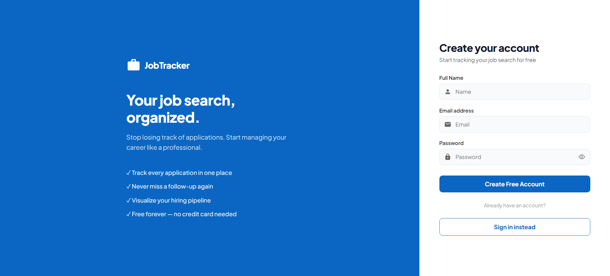
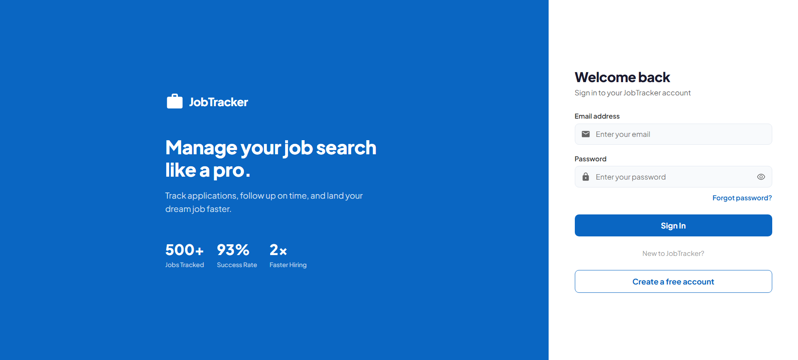
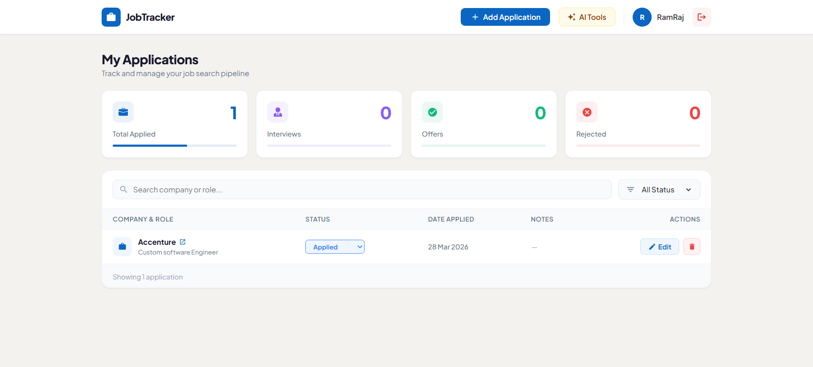
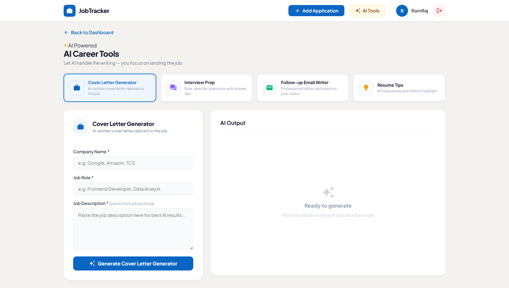

# 💼 AI-Powered Job Application Tracker
A production-ready full-stack MERN application that helps job seekers manage their
applications like a professional CRM pipeline — with 4 AI-powered tools built in.
  
## 🌐 Live Demo
| Service | URL |
|---|---|
| **Frontend** | [job-tracker-frontend-ramraj1440.vercel.app](https://ramraj-job-application-tracker.vercel.app/) |
| **Backend API** | [job-tracker-backend-6sth.onrender.com](https://job-tracker-backend-6sth.onrender.com) |
| **GitHub** | [github.com/RamRaj1440/job-tracker](https://github.com/RamRaj1440/job-tracker) |--
## 📸 Screenshots
### Register Page

### Login Page

### Dashboard

### AI Tools



--
## ✨ Features
### 🔐 Authentication System
- User Registration and Login
- JWT-based authentication with 7-day token expiry
- Forgot Password via email (Gmail + Nodemailer)
- Reset Password with secure crypto token (15 min expiry)
- Protected routes— each user sees only their own data
### 📋 Job Application Management (Full CRUD)
- Add applications with company, role, status, date, job link and notes
- Update application status through pipeline stages
- Edit all application details
- Delete applications
- Real-time dashboard stats
### 📊 Dashboard & Analytics
- Total Applications count
- Interviews count
- Offers count
- Rejections count
- Search by company or role name
- Filter by application status
### 🤖 AI Tools (Powered by Groq Llama 3.3 70B)
- **Cover Letter Generator** — paste job description, get a tailored cover letter
- **Interview Prep** — get role-specific questions with answer tips
- **Follow-up Email Writer** — professional follow-ups based on application status
- **Resume Tips** — ATS keywords and skills to highlight for the role
### 📧 Email Integration
- Professional password reset emails via Gmail + Nodemailer- Branded HTML email template
--
## 🛠 Tech Stack
### Frontend
| Technology | Version | Purpose |
|---|---|---|
| React.js | 19.x | UI Framework |
| Vite | 6.x | Build Tool |
| React Router DOM | 7.x | Client-side Routing |
| Axios | 1.x | HTTP Client |
| React Icons | 5.x | Icon Library |
### Backend
| Technology | Version | Purpose |
|---|---|---|
| Node.js | 22.x | Runtime Environment |
| Express.js | 5.x | REST API Framework |
| Mongoose | 9.x | MongoDB ODM |
| JSON Web Token | 9.x | Authentication |
| Bcrypt.js | 3.x | Password Hashing |
| Nodemailer | Latest | Email Service |
| CORS | 2.x | Cross-Origin Requests |
| Dotenv | 17.x | Environment Variables |
### Database & AI
| Technology | Purpose |
|---|---|
| MongoDB Atlas | Cloud Database |
| Groq API | AI Inference Engine |
| Llama 3.3 70B | AI Language Model |
### Deployment
| Service | Purpose | Cost |
|---|---|---|
| Vercel | Frontend Hosting | Free |
| Render | Backend Hosting | Free |
| MongoDB Atlas | Database Hosting | Free |
| UptimeRobot | Uptime Monitoring | Free |--
## 🚀 Getting Started
### Prerequisites
```
Node.js v18+
MongoDB Atlas account (free)
Groq API key (free)
Gmail account with App Password
```
### 1. Clone the Repository
```bash
git clone https://github.com/RamRaj1440/job-tracker.git
cd job-tracker
```
### 2. Setup Backend
```bash
cd backend
npm install
```
Create `backend/.env`:
```env
PORT=5000
MONGO_URI=your_mongodb_atlas_connection_string
JWT_SECRET=your_jwt_secret_key
FRONTEND_URL=http://localhost:5173
GROQ_API_KEY=your_groq_api_key
GMAIL_USER=your_gmail@gmail.com
GMAIL_PASS=your_16_digit_app_password
NODE_ENV=development
```
Start the backend:
```bash
npm run dev
```
Backend runs at: `http://localhost:5000`--
### 3. Setup Frontend
```bash
cd frontend
npm install
```
Create `frontend/.env`:
```env
VITE_API_URL=http://localhost:5000/api
```
Start the frontend:
```bash
npm run dev
```
Frontend runs at: `http://localhost:5173`--
## 📁 Project Structure
```
job-tracker/ ├──
 backend/ │   
├──
 config/ │   
│   
└──
 db.js                 # MongoDB connection │   
├──
 middleware/ │   
│   
└──
 authMiddleware.js     # JWT protect middleware │   
├──
 models/ │   
│   
├──
 User.js               # User schema │   
│   
└──
 JobApplication.js     # Job application schema │   
├──
 routes/ │   
│   
├──
 authRoutes.js         # Auth endpoints │   
│   
├──
 jobRoutes.js          # Job CRUD endpoints │   
│   
└──
 aiRoutes.js           # AI feature endpoints │   
├──
 .env                      # Environment variables │   
├──
 .gitignore │   
├──
 package.json │   
└──
 server.js                 # Express app entry point │
└──
 frontend/
    
├──
 src/
    
│   
├──
 components/
    
│   
│   
├──
 Navbar.jsx
    
│   
│   
└──
 StatsCard.jsx
    
│   
├──
 context/
    
│   
│   
└──
 AuthContext.jsx   # Global auth state
    
│   
├──
 pages/
    
│   
│   
├──
 Login.jsx
    
│   
│   
├──
 Register.jsx
    
│   
│   
├──
 ForgotPassword.jsx
    
│   
│   
├──
 ResetPassword.jsx
    
│   
│   
├──
 Dashboard.jsx
    
│   
│   
├──
 AddJob.jsx
    
│   
│   
├──
 EditJob.jsx
    
│   
│   
└──
 AITools.jsx
    
│   
├──
 services/
    
│   
│   
└──
 api.js            # All API call functions
    
│   
├──
 App.jsx               # Routes configuration
    
│   
├──
 main.jsx              # React entry point
    
│   
└──
 index.css             # Global styles
    
├──
 .env                      # Local env variables
    
├──
 .env.production           # Production env variables
    
├──
 vercel.json               # Vercel routing config
    
└──
 package.json
```--
## 🔌 API Endpoints
### Auth Routes `/api/auth`
| Method | Endpoint | Description | Auth |
|---|---|---|---|
| POST | `/register` | Register new user | ❌ |
| POST | `/login` | Login user + get JWT | ❌ |
| POST | `/forgot-password` | Send reset email | ❌ |
| PUT | `/reset-password/:token` | Reset password | ❌ |
### Job Routes `/api/jobs`
| Method | Endpoint | Description | Auth |
|---|---|---|---|
| GET | `/` | Get all jobs (search + filter) | ✅ |
| POST | `/` | Create new job application | ✅ |
| GET | `/:id` | Get single job | ✅ |
| PUT | `/:id` | Update job application | ✅ |
| DELETE | `/:id` | Delete job application | ✅ |
| GET | `/stats/summary` | Get dashboard stats | ✅ |
### AI Routes `/api/ai`
| Method | Endpoint | Description | Auth |
|---|---|---|---|
| POST | `/cover-letter` | Generate cover letter | ✅ |
| POST | `/interview-prep` | Generate interview questions | ✅ |
| POST | `/followup-email` | Generate follow-up email | ✅ |
| POST | `/resume-tips` | Generate resume tips | ✅ |--
## 🔐 Environment Variables
### Backend `.env`
| Variable | Description |
|---|---|
| `PORT` | Server port (default: 5000) |
| `MONGO_URI` | MongoDB Atlas connection string |
| `JWT_SECRET` | Secret key for JWT signing |
| `FRONTEND_URL` | Frontend URL for CORS |
| `GROQ_API_KEY` | Groq AI API key |
| `GMAIL_USER` | Gmail address for sending emails |
| `GMAIL_PASS` | Gmail App Password (16 digits) |
| `NODE_ENV` | development or production |
### Frontend `.env`
| Variable | Description |
|---|---|
| `VITE_API_URL` | Backend API base URL |--
## 🚢 Deployment
### Backend — Render
1. Push code to GitHub
2. Go to [render.com](https://render.com) 
→
 New Web Service
3. Connect your `job-tracker` repo
4. Set Root Directory: `backend`
5. Build Command: `npm install`
6. Start Command: `node server.js`
7. Add all environment variables
8. Deploy!
### Frontend — Vercel
1. Go to [vercel.com](https://vercel.com) 
→
 New Project
2. Import `job-tracker` repo
3. Set Root Directory: `frontend`
4. Add `VITE_API_URL` environment variable
5. Deploy!--
## 🧠 Key Technical Decisions
| Decision | Reason |
|---|---|
| JWT over Sessions | Stateless — works perfectly with separate frontend/backend
deployment |
| MongoDB over SQL | Flexible schema — job applications have varying fields |
| Groq over OpenAI | Free tier with fast inference — perfect for portfolio projects |
| Vite over CRA | 10x faster dev server and build times |
| Render over Heroku | Free tier available after Heroku removed free plans |--
## 🔒 Security Features- Passwords hashed with Bcrypt (10 salt rounds)- JWT tokens expire in 7 days- Password reset tokens hashed with SHA-256- Reset tokens expire in 15 minutes- Protected API routes via auth middleware- User data isolation — users only access their own data- Environment variables for all secrets- CORS configured for specific origins--
## 🐛 Known Issues & Limitations- Render free tier sleeps after 15 min inactivity (first request may take 30-60 seconds)- Groq API has rate limits on free tier- No email verification on registration (planned for v2)--
## 🗺 Roadmap (v2 Features)- [ ] Email verification on signup- [ ] Google OAuth login- [ ] Application notes with rich text- [ ] Interview date reminders
- [ ] Export applications to CSV- [ ] Mobile responsive improvements- [ ] Dark mode--
## 󰞵 Author
**RamRaj Devulapalli**- GitHub: [@RamRaj1440](https://github.com/RamRaj1440)- LinkedIn: [linkedin.com/in/ramraj](https://linkedin.com/in/ramraj)- Location: Hyderabad, India--
## 📄 License
This project is licensed under the MIT License.--
## 🙏 Acknowledgements- [Groq](https://groq.com) — for the blazing fast free AI inference API- [MongoDB Atlas](https://mongodb.com/atlas) — for the free cloud database- [Vercel](https://vercel.com) — for the free frontend hosting- [Render](https://render.com) — for the free backend hosting--
⭐ **If you found this project helpful, please give it a star on GitHub!**
